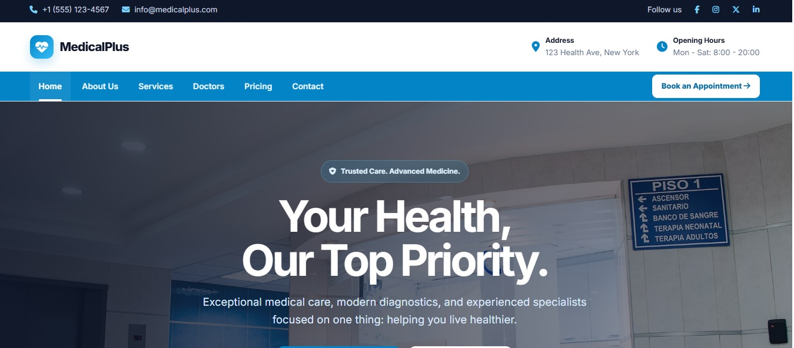
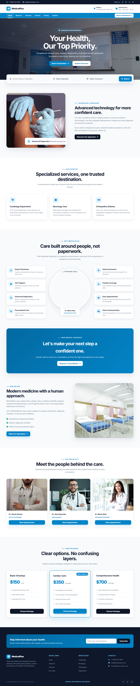

<p align="center">
  
</p>

# MedicalPlus

A modern healthcare landing page designed to present medical services, specialists, and patient-focused healthcare solutions through a clean and responsive interface.

## Overview

MedicalPlus is a responsive healthcare website concept built with a professional medical-focused UI. The project combines structured content, modern layouts, specialist profiles, service cards, appointment-focused sections, and responsive interactions.

## Screenshots

<p align="center">
  
</p>


## Features

* Responsive healthcare landing page
* Modern medical UI design
* Hero section with professional search
* Medical services cards
* Specialist profiles
* Why MedicalPlus feature section
* Appointment-focused CTAs
* Pricing section
* Newsletter subscription section
* Responsive navigation
* Mobile-friendly layout
* Scroll reveal animations
* Unsplash photography

## Built With

* HTML5
* CSS3
* JavaScript
* Unsplash

## Sections

* Top Bar
* Header
* Primary Navigation
* Hero
* Professional Search
* Healthcare Content
* Medical Services
* Why MedicalPlus
* Call to Action
* Who We Are
* Our Specialists
* Pricing
* Newsletter
* Footer

## Live Demo

* [🌐 GitHub Pages](https://starvixhub.github.io/MedicalPlus/)
* [🎨 CodePen](https://codepen.io/editor/sinarezaei/pen/01a11189-3662-7d9d-b2e0-b3aab2d10450)


```text
screenshots/
├── desktop.png
├── tablet.png
└── mobile.png
```

## Project Structure

```text
medicalplus/
├── index.html
├── README.md
└── screenshots/
    ├── desktop.png
    ├── tablet.png
    └── mobile.png
```

## Purpose

This project was created as a front-end design and development project to explore a complete healthcare landing page, combining visual design, responsive development, interaction, and structured user experience.

---

## License

This project is created as a personal design and development experiment.

Feel free to study the implementation and use the ideas as inspiration. Please do not present the original design or implementation as your own work.

---

## Author

**DESIGN & DEVELOPER BY SINA REZAEI**

---

© 2026 Sina Rezaei. All rights reserved.
